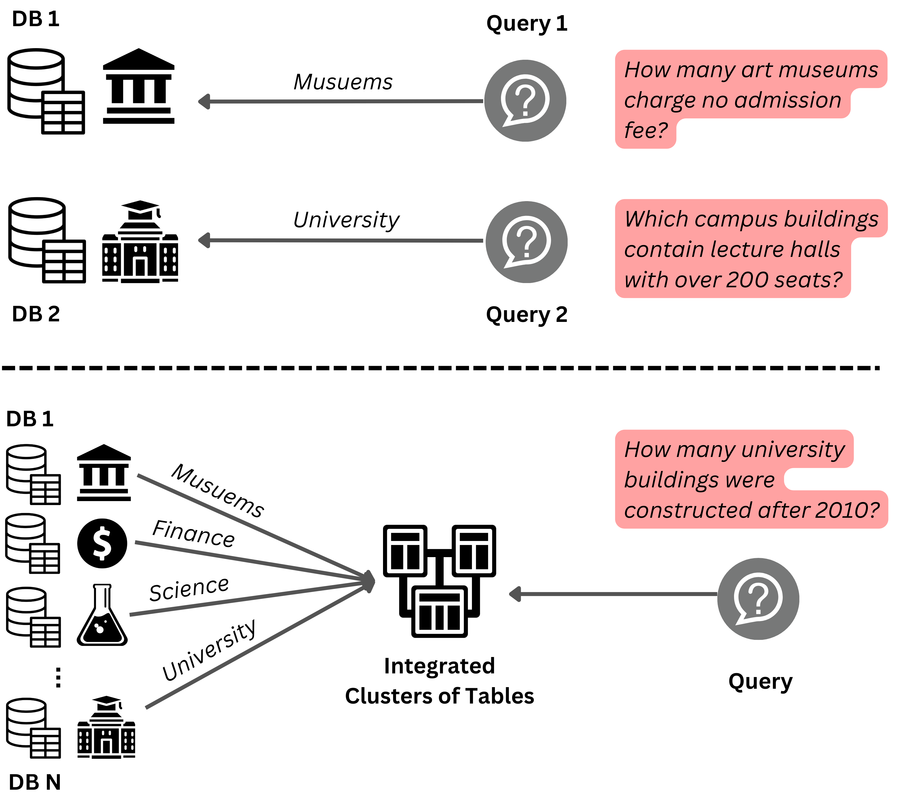
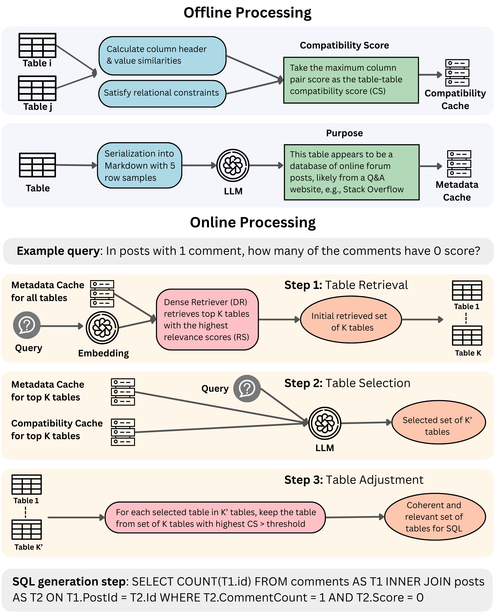

<!-- <p align="center">
  
</p> -->

## CORE-T: COherent REtrieval of Tables for Text-to-SQL

[](TBD.)
[](https://opensource.org/licenses/Apache-2.0)
[](https://www.python.org/)

<p align="center">
  
<p align="center">

Realistic text-to-SQL workloads often require joining multiple tables. As a result, accurately retrieving the relevant set of tables becomes a key bottleneck for end-to-end performance. We study an open-book setting where queries must be answered over large, heterogeneous table collections pooled from many sources, without clean scoping signals such as database identifiers. Here, dense retrieval (DR) achieves high recall but returns many distractors, while join-aware alternatives often rely on extra assumptions and/or incur high inference overhead. We propose CORE-T, a scalable, training-free framework that enriches tables with LLM-generated purpose metadata and pre-computes a lightweight table-compatibility cache. At inference time, DR returns top-K candidates; a single LLM call selects a coherent, joinable subset, and a simple additive adjustment step restores strongly compatible tables. Across BIRD, SPIDER, and MMQA, CORE-T improves table-selection F1 by up to 22.7 points while retrieving up to 42% fewer tables, improving multi-table execution accuracy by up to 5.0 points on BIRD and 6.9 points on MMQA, and using 4–5× fewer tokens than LLM-intensive baselines.

<p align="center">
  
<p align="center">

---

CORE-T is a **multi-table text-to-SQL pipeline** built around:

- **Offline preprocessing** of tables (markdown previews)
- **Table metadata generation** (LLM-generated purpose/summary/QA)
- **Pairwise table compatibility** estimation (joinability signals)
- **Dense retrieval** (FAISS) to get candidate tables per question
- **LLM-based table selection** (choose a coherent subset of joinable tables)
- **LLM SQL generation** (SQLite dialect) conditioned on schemas
- **Execution + evaluation** against gold execution results

This repository contains the code used to run the pipeline and reproduce the experiments in the paper.

Contact person: [Hassan Soliman](mailto:hassan.soliman@tu-darmstadt.de)

[UKP Lab](https://www.ukp.tu-darmstadt.de/) | [TU Darmstadt](https://www.tu-darmstadt.de/)

---

## Project Structure

```text
CORE-T/
├── .gitignore
├── LICENSE.txt
├── NOTICE.txt
├── README.md
├── requirements.txt
│
├── assets/                             # Figures used in the README
│   ├── intro.png
│   └── pipeline.png
│
├── offline_preprocessing/              # Offline preprocessing components
│   ├── table_preprocessor.py           # Table markdown preprocessing
│   ├── metadata_generator.py           # LLM-generated table metadata (purpose)
│   ├── compatibility_calculator.py     # Pairwise table compatibility
│
├── dense_retriever.py                  # FAISS dense table retrieval
├── table_selector.py                   # LLM table selection (+ augmentation)
├── sql_generator.py                    # SQL generation conditioned on selected tables
├── sql_executor.py                     # Execute generated SQLs against SQLite databases
│
├── evaluate_tables.py                  # Evaluate retrieved/selected tables vs gold
└── evaluate_sqls.py                    # Evaluate executed SQL results vs gold execution
```

---

## Datasets

We run experiments on **three text-to-SQL benchmarks**:

- **BIRD**
- **SPIDER**
- **MMQA**

We preprocessed these datasets to follow our open-book setting by merging tables from
multiple DBs (or question-specific schemas for MMQA) into a single retrieval corpus per benchmark. For convenience, we provide the required preprocessed `data/` and `sql_database/` folders (and an optional `cache/` folder) in a single download:

- You can access the datasets by following this [link](https://tudatalib.ulb.tu-darmstadt.de/handle/tudatalib/4993).

After downloading, extract the archive into the repository root so you get:

```text
data/<dataset>/...
sql_database/<dataset>/...
cache/<dataset>/<run_tag>/...    # optional: offline preprocessing artifacts
```

Notes:
- The `cache/` folder contains artifacts produced by the offline preprocessing scripts (e.g., enriched tables metadata, compatibility calculation).
- **Using the provided `cache/` is optional**: it can speed up running the online pipeline, but you can also regenerate it by rerunning the offline preprocessing steps in this README.

---

## Getting Started

### Installation

```bash
# install Python with uv (optional)
uv python install 3.12

# create a virtual environment
uv venv .venv

# activate the virtual environment
source .venv/bin/activate

# install dependencies
uv pip install -r requirements.txt
```

### Prerequisites

#### 1) Dataset files (`data/`)

Scripts assume the following dataset layout:

```
data/
└── <dataset>/
    ├── dev.json                 # list[dict], each with at least {db_id, question, ...}
    ├── dev_tables.json           # tables available for retrieval (db#sep#table keyed)
    ├── dev_gold_tables.json      # gold table sets for table eval (list[dict] with `tables`)
    └── dev_query_results.json    # gold execution results for SQL eval (list[list[dict]])
```

#### 2) SQLite databases (`sql_database/`)

The executor and preprocessing steps require SQLite database files under:

```
sql_database/
└── bird/
    ├── <db_id>/<db_id>.sqlite    # Bird-style nested dbs
    └── ...
```

For Spider-style layouts, the code also supports:

```
sql_database/
└── spider/
    ├── <db_id>.sqlite            # Spider-style flat dbs
    └── ...
```

#### 3) API keys / model access (`.env`)

Many steps use LangChain model IDs (e.g., `openai:gpt-4o-mini`, `huggingface:...`, `together:...`, `fireworks:...`).
Create a `.env` file in the repo root (depending on what model you will use):

```
OPENAI_API_KEY=...
HUGGING_FACE_HUB_TOKEN=...
TOGETHER_API_KEY=...
FIREWORKS_API_KEY=...
```

---

## Usage

CORE-T is organized as a set of standalone scripts. Most scripts derive default
cache/result paths from:

- `--dataset` (e.g., `bird`)
- `--llm-model`
- `--embedding-model`

The default run tag is:
\(`{llm-model}_{embedding-model}` with filesystem-safe characters\).

### 1) Offline preprocessing (one-time per dataset/run tag)

#### 1.1 Preprocess tables (markdown)

```bash
python offline_preprocessing/table_preprocessor.py \
  --dataset bird \
  --llm-model "huggingface:Qwen/Qwen2.5-7B-Instruct" \
  --embedding-model "fireworks:WhereIsAI/UAE-Large-V1"
```

Writes per-table cache files under:

```
cache/<dataset>/<run_tag>/preprocessed_tables/<db_id>#sep#<table>.json
```

#### 1.2 Generate table metadata (purpose + enriched tables)

```bash
python offline_preprocessing/metadata_generator.py \
  --dataset bird \
  --llm-model "huggingface:Qwen/Qwen2.5-7B-Instruct" \
  --embedding-model "fireworks:WhereIsAI/UAE-Large-V1"
```

Writes metadata caches under:

```
cache/<dataset>/<run_tag>/metadata/
├── purpose/
└── enriched_tables/
```

#### 1.3 Compute pairwise compatibility (joinability signals)

```bash
python offline_preprocessing/compatibility_calculator.py \
  --dataset bird \
  --llm-model "huggingface:Qwen/Qwen2.5-7B-Instruct" \
  --embedding-model "fireworks:WhereIsAI/UAE-Large-V1"
```

Writes per-pair caches under:

```
cache/<dataset>/<run_tag>/compatibility/<tableA>-<tableB>.json
```

### 2) Dense retrieval (FAISS)

```bash
python dense_retriever.py \
  --dataset bird \
  --top-k 10 \
  --llm-model "huggingface:Qwen/Qwen2.5-7B-Instruct" \
  --embedding-model "fireworks:WhereIsAI/UAE-Large-V1"
```

Outputs are written to:

```
results/<dataset>/<run_tag>/results_dense_retriever/
├── <dataset>_k_<top_k>.json
└── <dataset>_k_<top_k>_with_scores.json
```

### 3) Table selection (LLM chooses a coherent subset)

```bash
python table_selector.py \
  --dataset bird \
  --llm-model "huggingface:Qwen/Qwen2.5-7B-Instruct" \
  --embedding-model "fireworks:WhereIsAI/UAE-Large-V1" \
  --top-k 10
```

Writes:

```
results/<dataset>/<run_tag>/results_table_selection/
├── selected_tables.json
└── selected_tables_details.json
```

Useful options:
- `--partition / --num-partitions`: split work across machines; produces partitioned `selected_tables_<p>_of_<n>.json`
- `--threshold`: controls augmentation sensitivity

### 4) SQL generation (LLM generates SQLite SQL per question)

```bash
python sql_generator.py \
  --dataset bird \
  --sql-model "openai:gpt-4o-mini" \
  --llm-model "huggingface:Qwen/Qwen2.5-7B-Instruct" \
  --embedding-model "fireworks:WhereIsAI/UAE-Large-V1"
```

Writes:

```
results/<dataset>/<run_tag>/results_sql_generation/
├── sqls.json
└── sqls_details.json
```

Also uses a persistent SQL cache:

```
cache/<dataset>/<run_tag>/sql_generation/sql_generation_cache.json
```

### 5) SQL execution (run and execute generated SQLs)

```bash
python sql_executor.py \
  --dataset bird \
  --llm-model "huggingface:Qwen/Qwen2.5-7B-Instruct" \
  --embedding-model "fireworks:WhereIsAI/UAE-Large-V1"
```

Writes:

```
results/<dataset>/<run_tag>/results_sql_generation/
├── sqls_exec.json
└── sqls_exec_details.json
```

### 6) Evaluation

#### 6.1 Table evaluation (retrieved vs selected)

Evaluate dense retriever outputs:

```bash
python evaluate_tables.py \
  --dataset bird \
  --mode retrieved \
  --top-k 10 \
  --llm-model "huggingface:Qwen/Qwen2.5-7B-Instruct" \
  --embedding-model "fireworks:WhereIsAI/UAE-Large-V1"
```

Evaluate selected tables:

```bash
python evaluate_tables.py \
  --dataset bird \
  --mode selected \
  --llm-model "huggingface:Qwen/Qwen2.5-7B-Instruct" \
  --embedding-model "fireworks:WhereIsAI/UAE-Large-V1"
```

#### 6.2 SQL execution evaluation (rows vs gold)

```bash
python evaluate_sqls.py \
  --dataset bird \
  --llm-model "huggingface:Qwen/Qwen2.5-7B-Instruct" \
  --embedding-model "fireworks:WhereIsAI/UAE-Large-V1"
```

This compares `sqls_exec_details.json` against:

```
data/<dataset>/dev_query_results.json
```

---

## Expected outputs (high-level)

After running the full pipeline for one `(dataset, llm-model, embedding-model)` run tag, you should see these main artifacts and results:

```
cache/<dataset>/<run_tag>/
├── preprocessed_tables/
├── metadata/
├── compatibility/
├── selections/
└── sql_generation/

results/<dataset>/<run_tag>/
├── results_dense_retriever/
├── results_table_selection/
└── results_sql_generation/
```

---

## Model identifiers

CORE-T uses LangChain’s provider-prefixed model IDs in multiple places:

- **LLMs**: `openai:gpt-4o-mini`, `together:Qwen/Qwen2.5-7B-Instruct-Turbo`, `huggingface:meta-llama/Llama-3.1-8B-Instruct`
- **Embeddings**: `fireworks:WhereIsAI/UAE-Large-V1`, `openai:text-embedding-3-large`, `Snowflake/snowflake-arctic-embed-m-v2.0`

---

## Reproducibility notes

- **Caches matter**: most stages read or write persistent caches under `cache/<dataset>/<run_tag>/...`.

---

## Cite

Please use the following citation for the CORE-T paper:

```
@misc{soliman2026core-t,
    title       = {CORE-T: COherent REtrieval of Tables for Text-to-SQL}, 
    author      = {Hassan Soliman and Vivek Gupta and Dan Roth and Iryna Gurevych},
    year        = {2026},
    eprint      = {},
    archivePrefix={arXiv},
    primaryClass={cs.CL},
    url         = {https://arxiv.org/abs/}, 
}
```

---

## Disclaimer

> This repository contains experimental software and is published for the sole purpose of giving additional background details on the respective publication.